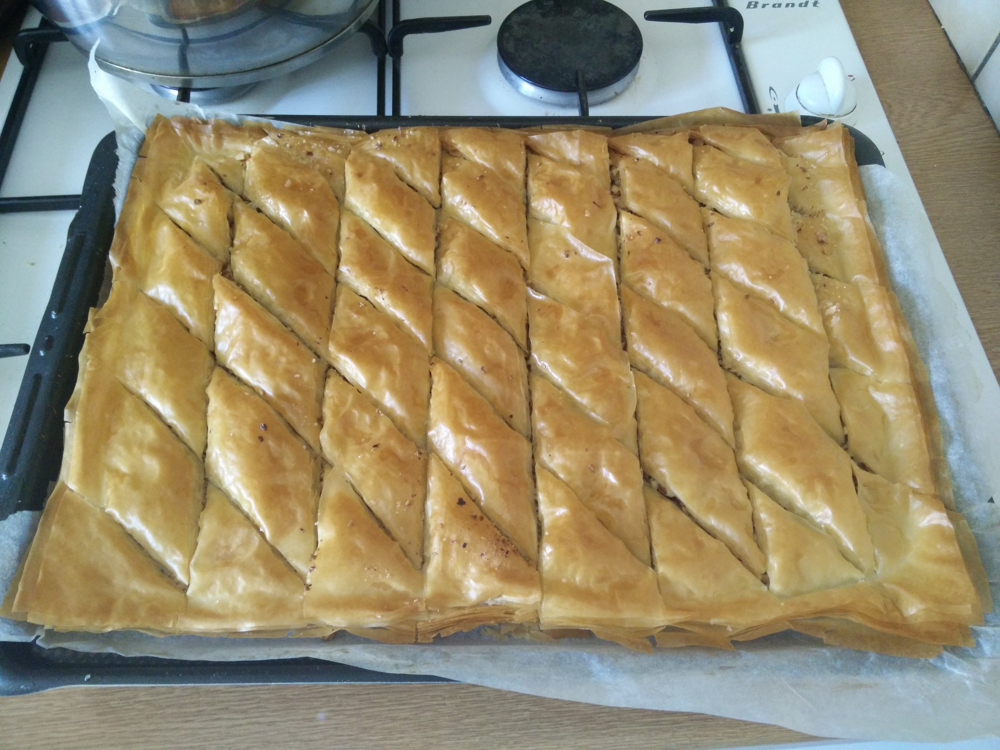

# Baklava

Une recette "type grand-mère" avec des quantités "à peu près", vu que je fais ça à vu de nez... Désolé!

Côté matériel, il vous faudra une plaque de cuisson et un pinceau de pâtisserie.

Côté ingrédients:
- 20 feuilles de pâte filo (c'est généralement vendu par 10 ou 20 ... "à peu près")
- Du beurre doux (disons 1/3 tablette)
- Des fruits à coque type noisettes / noix / pistaches... disons un bol rempli.
- Du sucre (disons un verre plein + une poignée)

---

1. Découper la pâte aux dimensions de votre plaque de cuisson.

2. Mixer les fruits secs grossièrement, y ajouter la poignée de sucre.

3. Faire fondre du beurre.

4. Éventuellement on peut mettre une feuille de papier sulfurisé sur la plaque de cuisson, c'est vous qui voyez.

5. Étaler une feuille de filo, la tartiner de beurre au pinceau.

6. GOTO 5 jusqu'à épuiser la moitié des feuilles.

7. Répartir les fruits à coque.

8. Courrez mettre votre four à préchauffer. 180°. Voilà, c'est bien, revenez.

9. Étaler une feuille de filo, la tartiner de beurre au pinceau.

10. GOTO 9 jusqu'à épuiser les feuilles.

11. Découper en losanges. Des beaux losanges si possible, bien réguliers. 20 ans que je fais des baklavas, et voilà à quoi ça ressemble :

J'espère que vous serez plus doué que moi.

12. Enfournez, le temps qu'il faut (disons, jusqu'à ce que ce soit bien doré, limite roussi).

Laissez refroidir.

Plus tard, préparez le sirop : moitié sucre, moitié eau (un grand verre plein de chaque). Mettez le tout dans une casserole et faîtes chauffer. Attendez que le sirop frémisse, sans aller jusqu'à caraméliser.

Versez le sirop chaud sur la baklava froide. Ou l'inverse, vous avez le droit aussi. Mais pas chaud sur chaud, parole de grand-mère.

[Revenir à l'index](../README.md)
