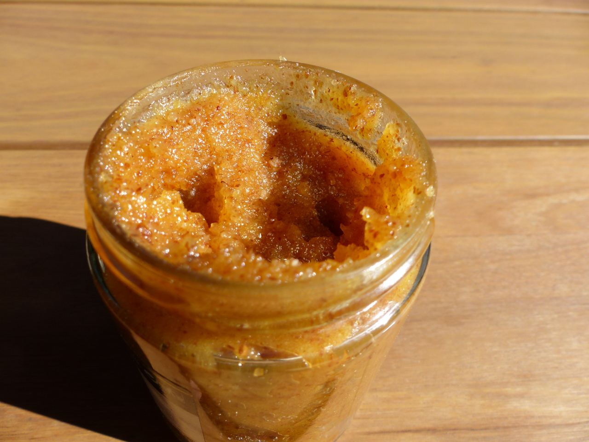
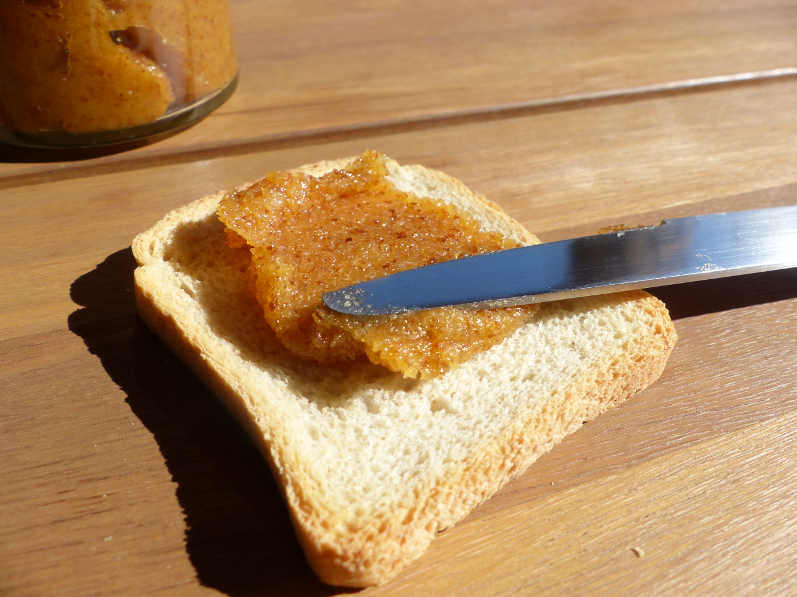

# Crème de Calissons

_La queen du ptit déj_

[Revenir à l'index](../README.md)

Best pâte-à-tartiner ever à l'unanimité de moi-même, la crème de calissons n'est pas très compliquée à faire, mais demande un peu de temps (à moins d'acheter du melon confit tout prêt mais c'est tricher).

## D'abord, le melon

En préalable, il faut des melons confits. [Cette recette](https://chichichoc.blogspot.com/2011/08/melon-confit.html) fait parfaitement l'affaire, inutile de la recopier ici. Pour résumer, il faut le même poids en melon, en eau et en sucre. Tous les jours pendant une semaine, on fait bouillir le sirop (sans le melon) puis on réserve (avec le melon). Consultez le site pour les détails. Il n'y a pas de difficulté, c'est juste un peu long. Pour les quantités, 500g de melon frais donnera à peu près 2 pots à confiture de crème de calissons bien remplis.

Deux petites notes :

- L'essentiel c'est d'avoir un melon bien parfumé. S'il n'est pas très sucré, ce n'est pas grave, c'est négligeable par rapport au sucre qu'on ajoutera.

- On peut écourter la recette en ne faisant sécher les melons qu'un jour.

## Et des peaux d'orange

Il faudra quelques écorces d'oranges confites (1g par 6g de melon confit). On peut en trouver dans le commerce, ou les faire soi-même. Découpez quelques peaux d'oranges en lamelles, retirer un peu de ziste (la partie blanche) pour enlever de l'amertume, selon vos préférences, et faites-les confire :

- D'abord plonger dans l'eau froide et faire bouillir 10 minutes
- Jeter l'eau, rincer, peser, ajouter le même poids en sucre, recouvrir d'eau et remettre à bouillir à feu doux.
- Lorsque l'ébullition commence, couper le feu, laisser refroidir.
- Refaire bouillir dans le même sirop 2 fois supplémentaires.
- Laisser dans le sirop une nuit avant de les mettre à sécher.

## Les saisons dans tout ça ?

Et oui, bien vu, on a là un fruit d'été et un fruit d'hiver, pas hyper pratique! Qu'à cela ne tienne, l'un comme l'autre se congèle très bien. Et puis franchement, un stock d'écorces d'oranges c'est toujours utile pour combler une petite envie soudaine d'orangettes.

## Ingrédients

Adaptez les proportions en fonction de la quantité de melon confit que vous avez. Mon expérience : 500g de melon frais a donné 240g de melon confit (séché 3-4 jours, donc plus si on sèche moins), puis deux pots de 40cl de crème de calissons. Voici les proportions pour un pot de 40cl :

- 140g d'amandes (si émondées : texture plus fluide, plus claire, moins de fibres) (ou de la poudre directement si vous trichez)
- 80g de sucre
- 120g de melon confit
- 20g d'écorces d'oranges confites
- 1/4 cuillère à café d'extrait d'amande amère
- 10ml de jus de citron soit environ un quart de citron, jaune ou vert

## Sirop puis mixage

- Préparez un sirop de sucre en versant le sucre à peine recouvert d'eau dans une casserole ainsi que le jus de citron et faire bouillir.
- Pendant ce temps, mixez les amandes en poudre.
- Ajoutez le melon, les écorces d'oranges, l'extrait d'amande amère et le sirop encore chaud, et re-mixez (éventuellement utilisez un gros blender plutôt qu'un petit mixeur pour cette étape, ou ne lui en demandez pas trop, j'en ai grillé un comme ça).

Normalement grâce au sirop de sucre, on doit obtenir une pâte onctueuse. Si elle vous paraît trop sèche / trop collante, n'hésitez pas à ajuster avec un peu d'eau. Si elle est trop liquide... vous ferez mieux la prochaine fois!

_L'aspect brunâtre ici est dû aux amandes non émondées_

[Revenir à l'index](../README.md)
