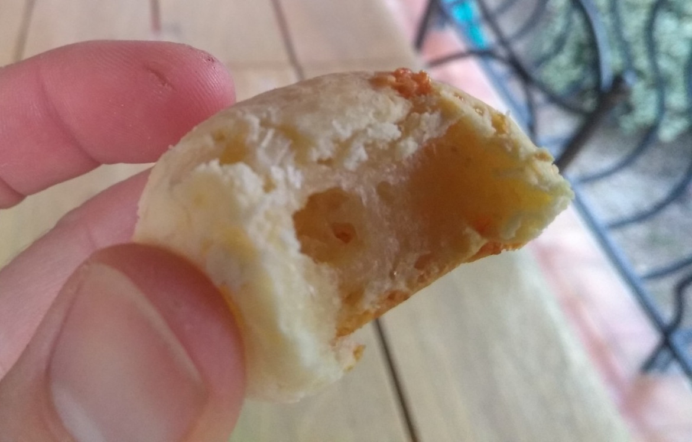
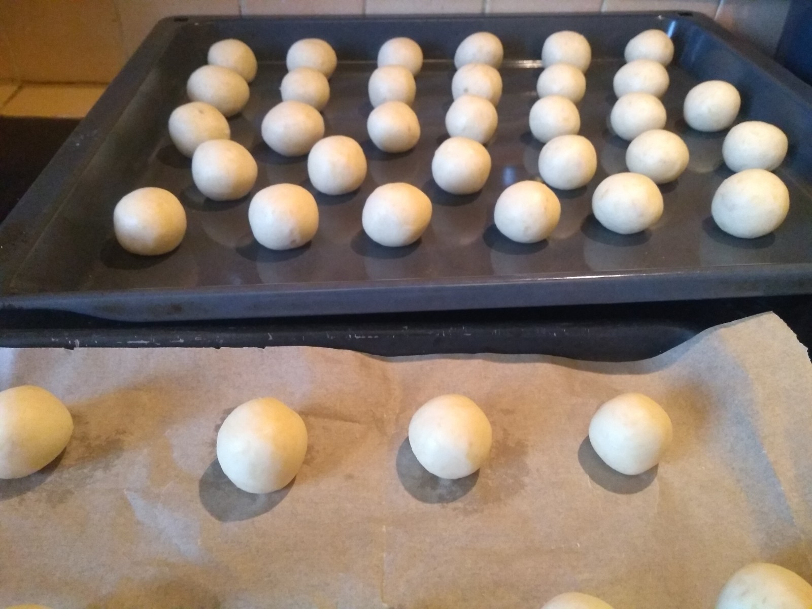
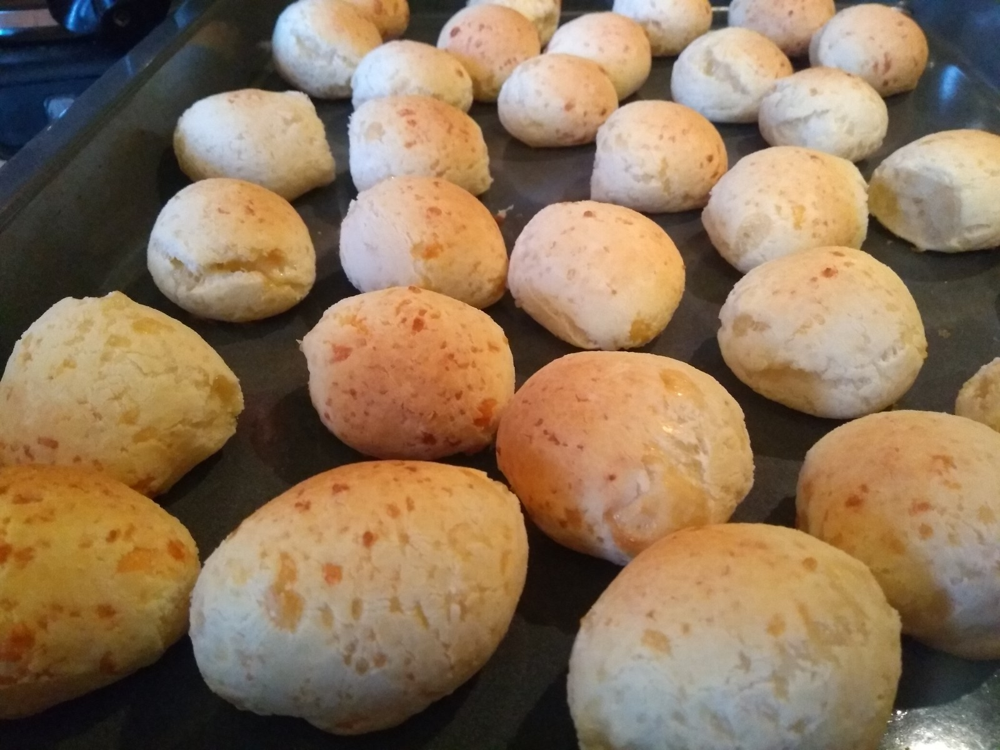

# Cuñapes

_La joya Boliviana_

[Revenir à l'index](../README.md)

Parenthèse salée avec “El Cuñapé”, un petit bijou gourmand de la cuisine Bolivienne... Miam! C'est au détour d'un faubourg de Santa Cruz que je suis tombé sous le charme de cette cuisine de rue. Tamales, Anticuchos... et donc, Cuñapes, des petites boulettes de pain au fromage, toutes simples mais tellement bonnes et moelleuses.

Les Brésiliens connaissent ça sous le nom de Pão de Queijo.

La plus grande difficulté de la recette consistera à trouver de la fécule de tapioca / yuca.

## Vous avez dit yuca ?

On va faire un petit détour et parler des mots. Tapioca? Yuca? Yucca? Manioc? En Français, la plante qui nous intéresse ici c'est le manioc, dans sa variété amère. Et le tapioca n'est autre que la fécule issue de cette plante. Le Yuca... c'est la même plante, mais nommée ainsi en Espagnol. On peut aussi lire le terme de "Cassava" ou "Casava", c'est pareil. C'est une plante tropicale, qu'on trouve par exemple dans les régions amazoniennes. Quand j'ai vu que j'avais chez moi, dans le sud de la France, du Yucca, je me suis dit chouette allons chercher ses racines! Bon ben, non en fait. Yucca, avec deux "c", ça n'a absolument rien à voir avec le Yuca. Il faudra trouver autre chose pour s'en procurer.

## Où trouver du tapioca ?

Ce n'est pas toujours simple à trouver, du moins selon où on habite. Personellement c'est dans les magasins / marchés asiatiques que je trouve mon bonheur. C'est de la fécule qu'il faut ("starch") - on trouve parfois du "tapioca" en magasin bio, mais différent, sous forme de granules. La fécule doit être bien blanche et poudreuse. Pour info, on a testé les Cuñapes avec le tapioca "granules", ce n'est pas du tout inintéressant, c'est plus croquant et moins moelleux. Ça gonfle moins, aussi. Mais ça reste gourmand!

## Ingrédients

Pour un saladier rempli de Cuñapes, il vous faudra:
- 400g de tapioca (fécule)
- 350g de fromages*
- 2 oeufs
- 40g de beurre à température ambiante
- 3 cuillères à café de sel
- 120ml de lait

*Parlons fromages. Ce ne sera pas évident de trouver des fromages boliviens sous nos lattitudes. Heureusement, on n'est pas mal lotis en France (et en Italie). Laissez parler votre instinct. Un mix de fromages d'ici peut très bien faire l'affaire. Emmental, Comté, Parmesan, Beaufort... Un mélange que j'apprécie bien, c'est 2/3 comté (pas trop agé) et 1/3 emmental. J'ai aussi déjà fait avec de la mozzarella. Le type provolone doit bien fonctionner aussi. Tout se tente.

## Recette

De la pointe des doigts, mélangez la fécule, le fromage (que vous aurez bien entendu préalablement rapé, ne soyez pas bêtes), les oeufs, le beurre et le sel.

Ajoutez petit à petit le lait tout en mélangeant. La pâte doit rester assez compacte - si elle devient souple, ne mettez pas tout le lait. Cela peut dépendre des fromages utilisés.

Réunissez la pâte en une boule, et laissez reposer une dizaine de minutes minimum (si vous laisez reposer plus longtemps, couvrez d'un linge humide).

Préchauffez le four à 215.

Formez des petites boules, pas plus grandes qu'une balle de ping-pong, et déposez-les sur une plaque allant au four, en laissant de l'espace entre elles car elles vont gonfler.

Enfournez environ 13 minutes.

[Revenir à l'index](../README.md)
