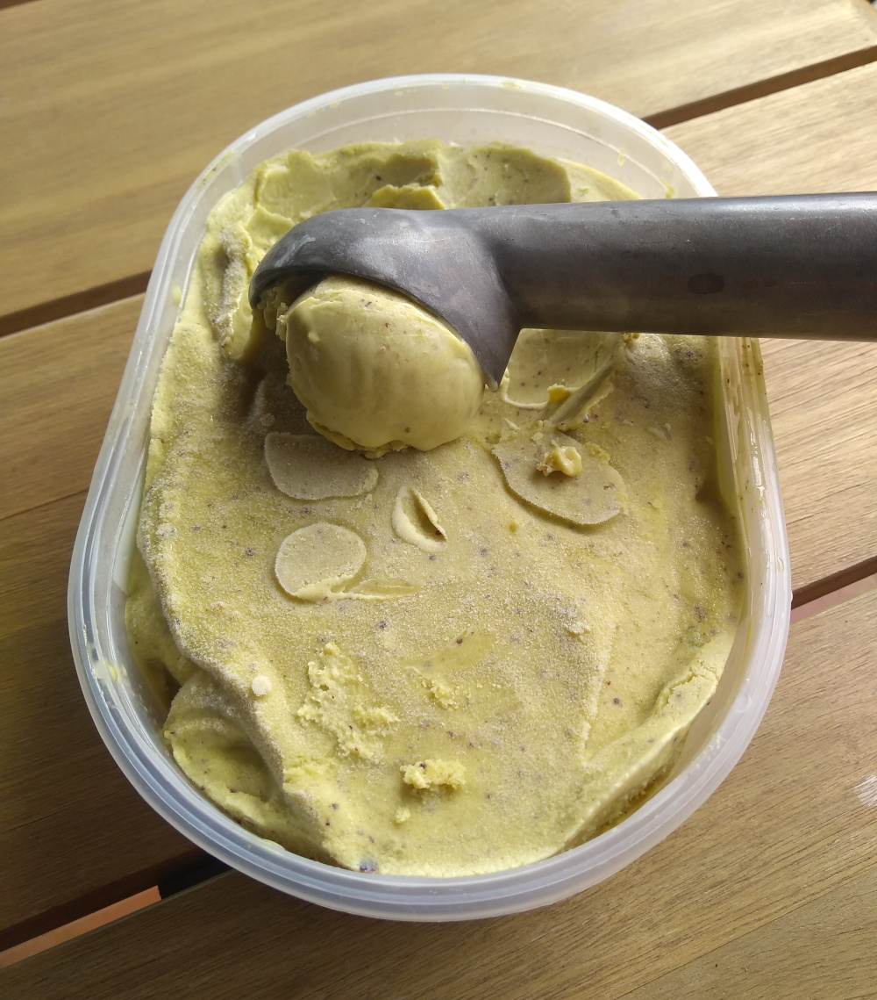
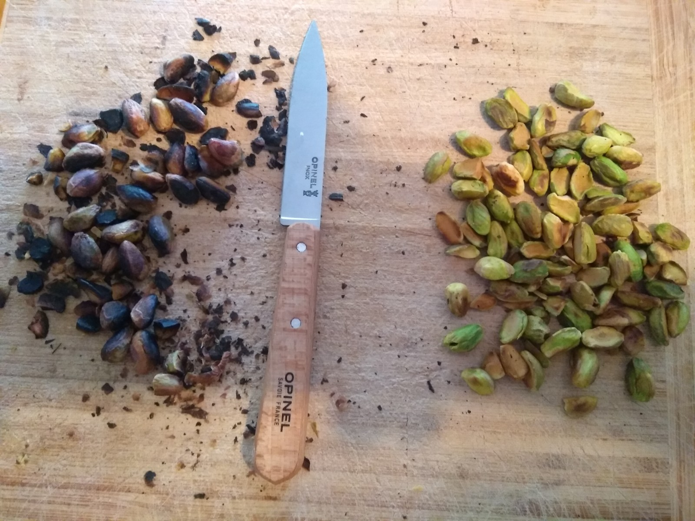
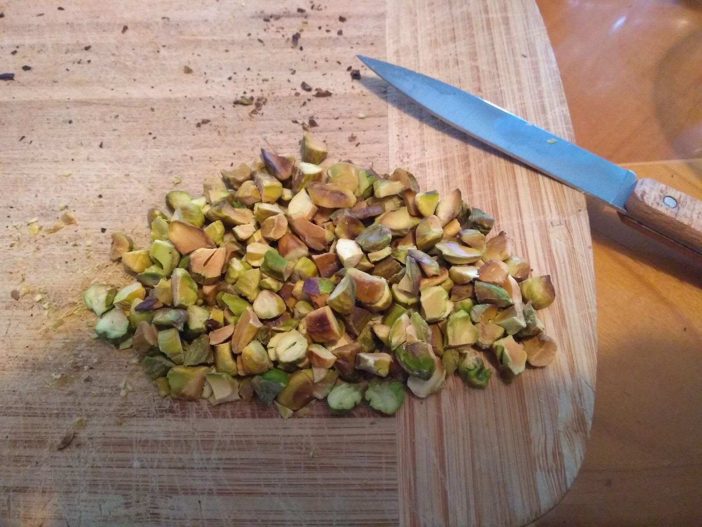
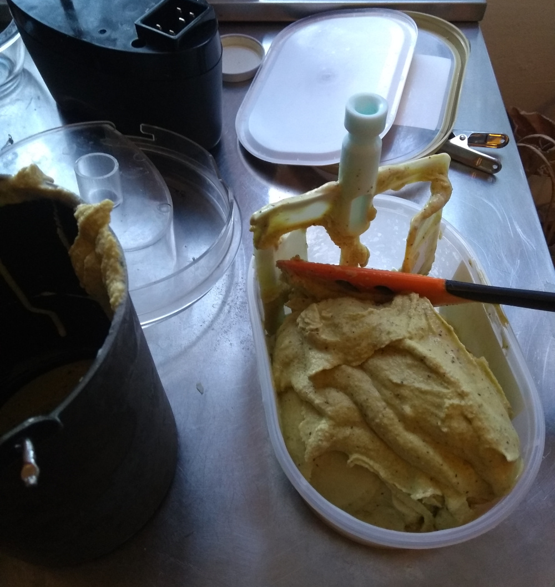

# Glace Pistache

[Revenir à l'index](../README.md)

Dans la vie, il y a deux types de glaces à la pistache : celles à l'arôme pistache ("naturel" ou artificiel, peu importe), et celles sans. Les premières constituent au doigt mouillé peut-être 99% de celles qu'on trouve partout. Je préfère de loin les secondes, au goût plus subtil et plus proche du fruit sec. C'est bien évidemment de celles-là qu'on va parler.

Je suis parti de [cette recette](https://chichichoc.blogspot.com/2022/06/glace-la-pistache-la-sicilienne-sans.html) du blog _Chic chic chocolat_, et finalement très peu modifiée. N'hésitez pas à aller voir l'original.

## Matériel et ingrédients

Il faut bien sûr une sorbetière ([example](https://www.domo-elektro.be/fr/cuisine/gla%C3%A7ons-et-cr%C3%A8me-glac%C3%A9e/sorbeti%C3%A8re-0) -- il existe des recettes sans sorbetière mais pas sûr que ce soit adaptable à cette recette. Si vous essayez.. you're on your own!)

Côté ingrédients, il faudra dégoter de la purée 100% pistache crue (en magasin bio, mais c'est assez cher... le blog de la recette originale suggérait [Koro.fr](http://www.koro.fr/_), moitié moins cher). Et de l'amaretto. À noter qu'ajouter de l'alcool dans une glace a l'avantage de l'assouplir, mais n'en mettez pas trop ou elle risque de ne pas prendre du tout. Dans cette recette, je fais chauffer l'amaretto pour diminuer le taux d'alcool, pour les enfants, tout en gardant l'arôme. Suivez-la ou pas, c'est vous qui voyez ;-)

Il faudra donc :

- 400g de lait
- 50g + 50g de sucre
- 15g de maïzena
- 120g de purée de pistache crue
- 20cl de crème fraîche
- 2 cuillères à soupe d'Amaretto
- 30g de pistaches non salées

Il faut bien sûr aussi un bac à glace vide et un peu de place au congélo.

## Préparation (~12 heures avant turbinage)

Délayer la maïzena dans un peu de lait, puis ajouter le reste de lait et la moitié du sucre.

Mettre à chauffer, en remuant régulièrement, jusqu'à épaississement.

En parallèle, faire chauffer / frémir l'amaretto avec le reste de sucre et un fond d'eau, pendant quelques minutes.

Reverser le lait dans un saladier et laisser tiédir 10 minutes. Mélanger ensuite tout ensemble: le lait, le sirop d'amaretto, la crème fraîche et la purée de pistache. Garder juste les 30g de pistaches de côté. Réserver au frais. Mettez déjà au congélateur le récipient de la sorbetière et le bac à glace vide.

## Attendre

Sortez le chien, allez voir votre mère ou parlez aux pigeons, comme vous voulez.

## Torrefaction

La petite touche qui rend cette recette excellente, ce sont les pistaches torréfiées et coupées en morceaux. Avant de les passer à la poêle, retirez la petite peau qui peut les recouvrir. C'est un peu galère, elle ne se retire pas toujours bien, mais l'enlever apportera une petite touche divine à la dégustation! Perso je trouve ça plus facile à faire avant la torréfaction (contrairement aux noisettes, dont la peau se détache toute seule à la torréfaction).

Ensuite, passez-les à la poêle quelques minutes. Vous sentirez leur délicieux parfum, irrésistible... et là, je vous vois prêts à en piquer... bonne nouvelle! vous avez le droit! J'ai prévu ça dans les doses. Sacré jojo. N'en prenez pas trop non plus, genre cinq ou six... OK, sept si vous voulez.

Attention par contre à ne pas les faire cramer, comme moi :

_À gauche, c'est cramé; à droite, c'est bon_

Coupez-les ensuite à votre convenance...

_Après la découpe_

## Turbinage

On peut passer au turbinage. Faîtes selon votre appareil. Lorsque la glace commence à prendre, en fin de turbinage, ajoutez les morceaux de pistaches.

_Mise en bac_

Laisser prendre au congél au moins quelques heures avant d'attaquer la dégustation.

[Revenir à l'index](../README.md)
