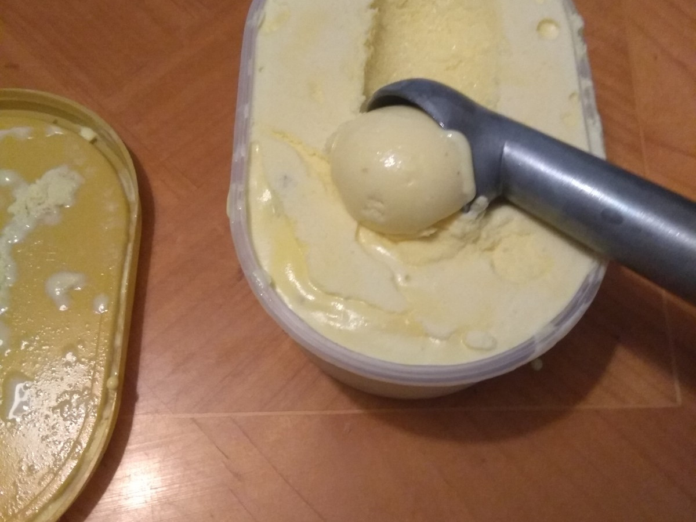
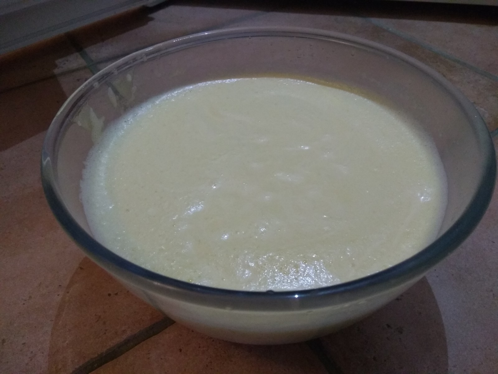
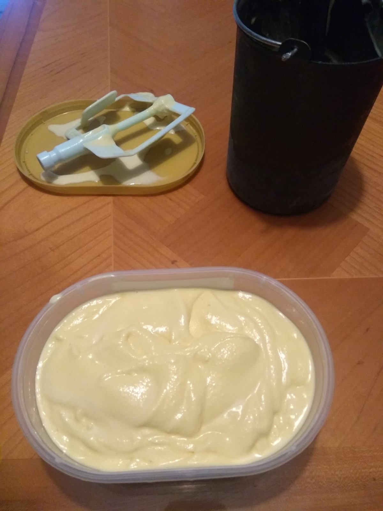

# Glace Sabayon-Rhum aux noix

[Revenir à l'index](../README.md)

Une glace coup-de-cœur qui m'évoque obligatoirement l'Argentine, cet autre grand pays des crèmes glacées : celles au sabayon, peu fréquentes en France, font partie des classiques là-bas. C'est en tout cas dans ce pays que je les ai découvertes.

Le mariage avec le rhum, et quelques fruits à coque pour apporter une touche croquante, fonctionne parfaitement. On peut caraméliser ses noix/amandes/..., personellemment j'apprécie autant des morceaux de noix tous simples.

L'alcool a un autre avantage dans les glaces : ne gélant pas au congélateur, il les rend moins compactes, plus souples.

## Ingrédients et matériel

Rien de compliqué à trouver côté ingrédients :

- 8 jaunes d'œufs ([je me répète](../Glace%20Pralin%C3%A9/README.md#la-glace), mais n'hésitez pas à congeler les blancs)
- 40 cl de crème liquide* bien froide
- 160g de sucre
- 8cl de rhum dilué dans 8cl d'eau
- Une dizaine de cerneaux de noix

*: on utilise habituellement de la crème liquide à monter en chantilly, assez neutre en goût - pour cette glace j'aime bien aussi utiliser de la crème épaisse d'Isigny, qui apporte un goût plus prononcé, légèrement acidulé. Par exemple avec un mix 20cl liquide + 20cl épaisse.

Pour le matériel, il faudra une sorbetière / turbineuse. Placez le bac de la turbineuse au congél, ainsi qu'un bac à glace vide. Mettez y aussi le  saladier que vous allez utiliser pour faire monter la crème.

## Préparation (~4-10 heures avant turbinage)

Fouettez la crème fraîche bien froide avec un batteur électrique pour la monter comme une chantilly, puis réservez au frigo.

Faîtes bouillir le sucre avec le rhum dilué. Dans un saladier, fouettez les jaunes, et versez-y en filet le sirop sans arrêter de fouetter. Le mélange va devenir mousseux.

Incorporez petit à petit ce sabayon dans la crème montée, en mélangeant délicatement. Réservez au frigo.

_Préparation au sabayon_

## Turbinage

On peut passer au turbinage. Faîtes selon votre appareil. Lorsque la glace commence à prendre, en fin de turbinage, ajoutez les morceaux de noix.

_Mise en bac_

Laisser prendre au congél au moins quelques heures avant d'attaquer la dégustation. Du fait de l'alcool, cette glace plus de temps qu'une autre à bien se solidifier.

[Revenir à l'index](../README.md)
