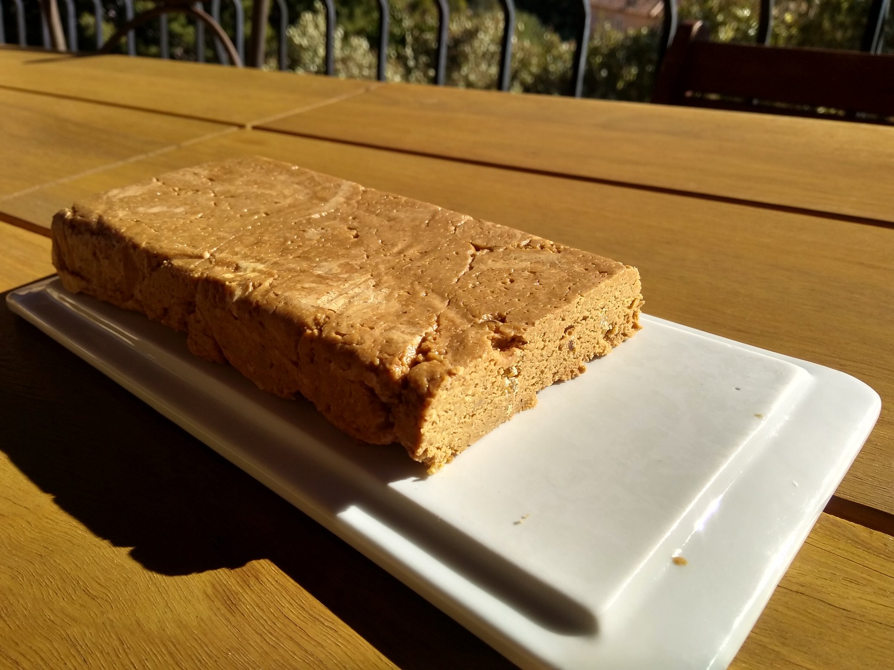

# Full Stack Pastry

Quelques recettes open-source (MIT), pull-requests bienvenues!

## [Crème de Calissons](./Crème%20de%20Calissons)

> Best pâte-à-tartiner ever à l'unanimité de moi-même, la crème de calissons n'est pas très compliquée à faire [...]

## [Nougahuète](./Nougahuète) aka Mantecol aka nougat de cacahuètes

> Je ne connais pas d'autre nom pour ce nougat de cacahuète que celui qu'on trouve communément en Argentine [...] alors faute de mieux, on appelera ça ici du "nougahuète".

## Glace Sabayon-Rhum

À venir

## Baklava

À venir

## Le Parchemin de Cuges

À venir
