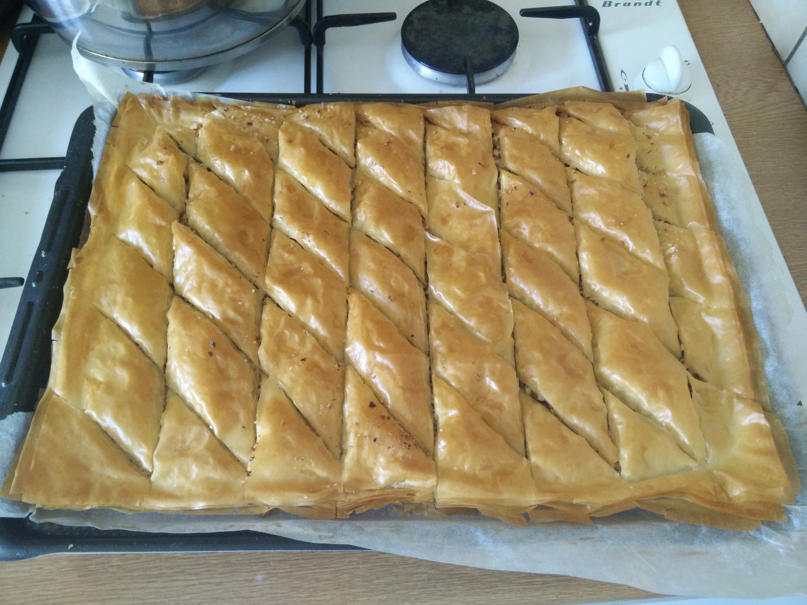

# Full Stack Pastry

Quelques recettes open-source (MIT), pull-requests bienvenues!

## [Crème de Calissons](./Crème%20de%20Calissons)

> Best pâte-à-tartiner ever à l'unanimité de moi-même, la crème de calissons n'est pas très compliquée à faire [...] [Lire la suite](./Crème%20de%20Calissons).

## [Nougahuète](./Nougahuète) aka Mantecol aka nougat de cacahuètes

> Je ne connais pas d'autre nom pour ce nougat de cacahuète que celui qu'on trouve communément en Argentine [...] alors faute de mieux, on appelera ça ici du "nougahuète". [Lire la suite](./Nougahuète).

## [Baklava](./Baklava)

> La *vraie* recette de la baklava, *à peu près*. [Lire la suite](./Baklava).

## [Glace Pistache](./Glace%20Pistache)

> Dans la vie, il y a deux types de glaces à la pistache [...] [Lire la suite](./Glace%20Pistache).

## [Lemon Curd](./Lemon%20Curd)

> Une recette plutôt simple et rapide, mais néanmoins sympa et utile lorsqu'on ne sait plus quoi faire de ses citrons [...] [Lire la suite](./Lemon%20Curd).

## Glace Sabayon-Rhum

À venir

## Le Parchemin de Cuges

À venir
